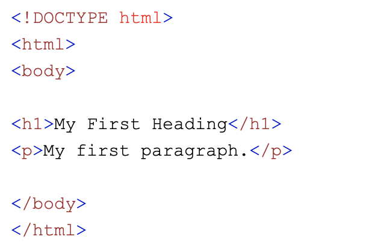

# what-i-learned-week-1
### HTML

<li>html always start with !DOCTYPE html</li>

<li>can put style on heading</li>

<li>Has precedent over css, that's why not recommended to write directly on html
</li>

[web cheat sheet](http://www.simplehtmlguide.com/cheatsheet.php)

### CSS
<li>always remember to close }</li>
<li>.for class and # for id</li>
<li>padding is space between the element and the border, where margin is the space between two border</li>
<li>when using animation always remember @keyframes</li>
<li>between two same elements the bottom line always take precedent</li>
